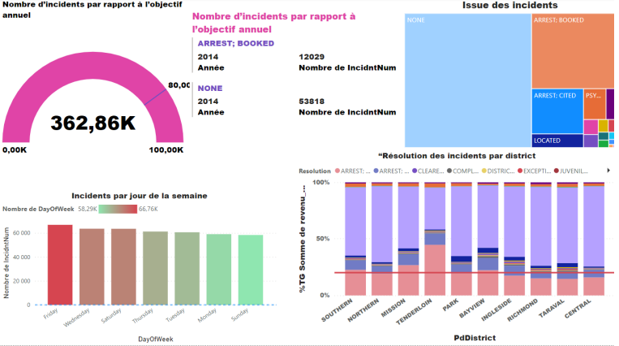

# Projet POWER-BI

Ce projet de power BI vise à manipuler des données et à créer des tableaux de bord. Le dataset utilisé concerne les incidents répertoriés par le département de police de San Francisco. Ce jeu de données inclut la catégorie des incidents, la date et le lieu où ils se sont produits, ainsi que leur résolution. La source des données est accessible via le lien suivant  : [Lien de dataset](https://data.sfgov.org/Public-Safety/Police-Department-Incident-Reports-Historical-2003/tmnf-yvry/about_data)

Nous avons obtenu les tableaux de bord suivants :

Et :

